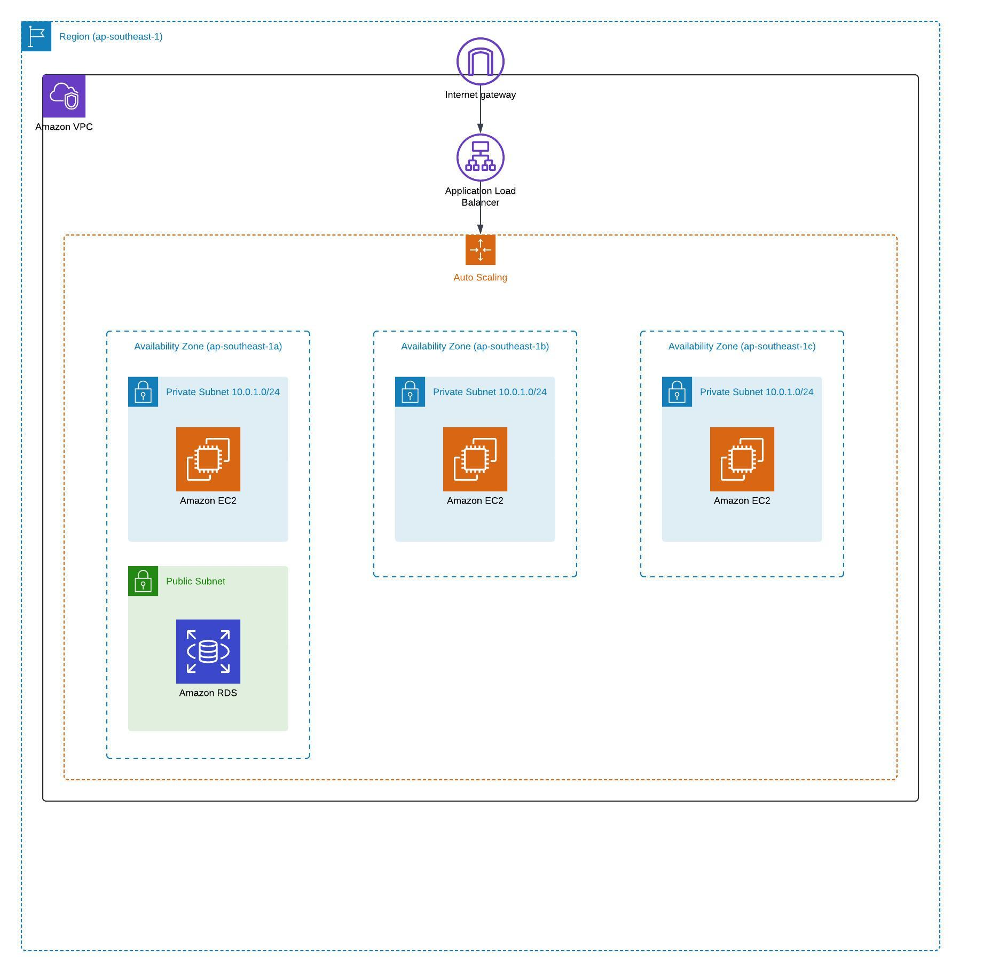
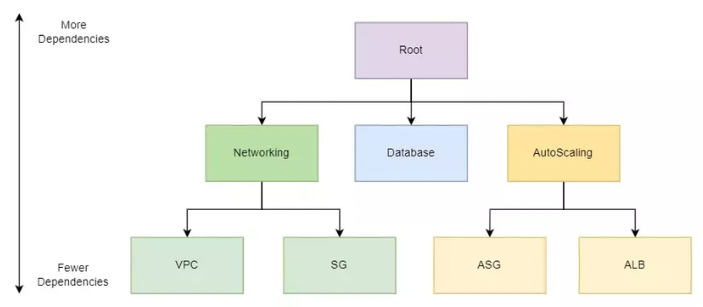

## Architecture overview

## Module structure

## Set up environement for labs
 - Create a VPC with 3 public subnets in each AZ
 - Create a Security Group called public-sg (allow ingress ssh and http::80, egress all)
 - Create an Internet Gateway, attached to VPC
 - Create a Route Table allow everywhere to IG, attached to public subnets
 - Create an EC2 launch template amazon linux 2023 and metadata quick start httpd, attached SG public-sg

## Lab 1: simple ALB
 - Create 3 EC2 instances for each subnet
 - Create Target Group, includes those instances
 - Create Load Balancer (default: round robin)
 - Retrieve ALB DNS name and self test round robin mechanism
 - Check Target Group should healthcheck success for all instances

## Lab 2: ALB and simple EC2 Auto Scaling
 - Remove all EC2 instances
 - Launch EC2 Auto Scaling (min=1, max=3, desired=1)
 - After launched, you can see there's gonna be 1 EC2 (as specify desired=1)
 - Check Target Group should healthcheck success for that instance
 - Check ALB activity history
 - Adjust ALB desired-capacity to 2, and self test again
 - Check Auto Scaling acticity history

## Lab 3: EC2 dynamic scaling
 - Create dynamic policy (cpu 40% threshold)
 - Connect ssh to any EC2, stress test to make it scale out (https://cloudkatha.com/how-to-install-stress-on-amazon-linux-2023/)
   - Update package manager `sudo dnf update`
   - Search `dnf search stress` 
   - Install `sudo dnf install stress -y` 
   - Stress your CPU `stress --cpu 4  --timeout 500` 
 - 5 mins later, check CloudWatch alarm, and action it takes
 - Watch Auto Scaling activity / monitor screen

## Assignment (inspired from https://docs.aws.amazon.com/autoscaling/ec2/userguide/tutorial-ec2-auto-scaling-load-balancer.html)
 - Create a DNS record CNAME for ALB
 - Create a ACM for that record to achieve in-transit encryption
 - Force https for ALB (redirect http to https)
 - EC2 re-use keypair ~/.ssh/aws_projects
 - Create IAM role for Auto Scaling perform actions on your behalf

### EC2 Auto Scaling cool features:
 - Instance refresh
 - Lifecycle hooks: listern on changes of states (Initialize, InService)
 - Warm pool: is a pool of pre-initialized EC2 instances (this helps you to ensure that instances are ready to quickly start serving application traffic)
 - Tempt remove instances: InService to Standby
 - Scale-in protection
 - Rebalancing events
 - Deregistration delay trong 300ms nghia la khi scale in / teminate đi 1 con instance, aws se khong terminate ngay lap tuc. De cho nhung on-going request khong bi interupt. Va ke tu luc quyet dinh terminate, ALB se khong gui request den instance do nua. Nen chu y tham so nay neu application co nhung request compute lau, vd convert video, thi co the adjust delay 5 mins.
 - Instance mainternance policy
   - Launch before terminating: availability over cost savings
   - Terminate and launch: both at the same time, cost savings over availability
     - use this in assignment
     - although most of the case (healthcheck fail, instance refresh, maximum lifetime use this policy)
   - Custom policy: custom minimum and maximum range for the amount of capacity that you want available when replacing instances